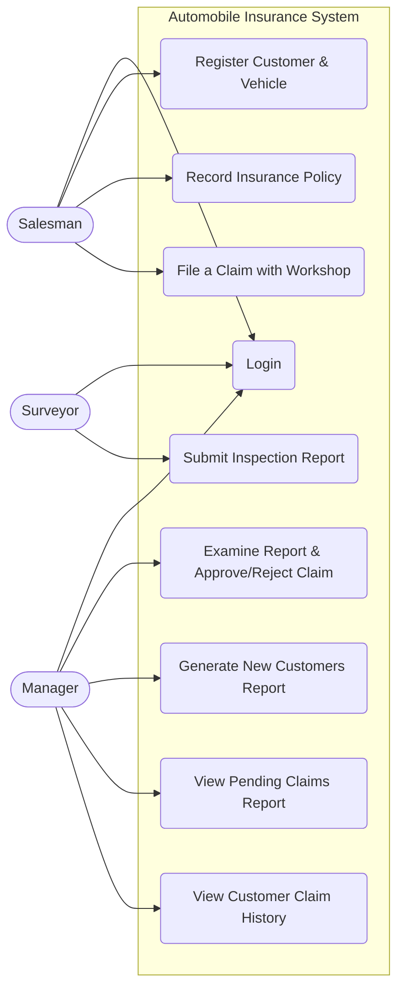
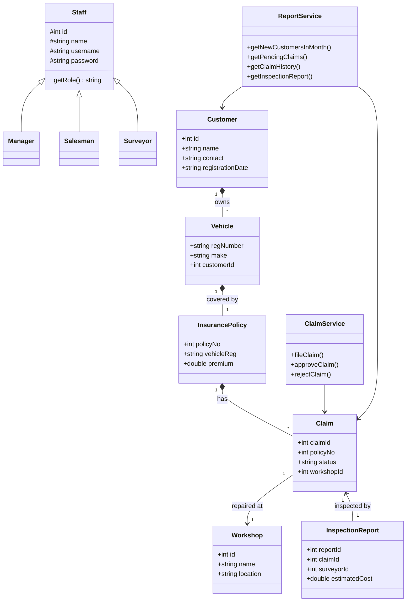

# Automobile Insurance Management System

## Project Overview
This is a C++ based Information System developed for an automobile insurance company. The system operates on a robust **N-Tier Architecture**, utilizing file-based persistence (CSV) without reliance on external Database Management Systems (DBMS). It demonstrates strict adherence to Object-Oriented Analysis and Design (OOAD) principles and modern software engineering patterns.

## Software Development Life Cycle (SDLC)

### 1. Requirements Gathering
The system was designed to handle three distinct employee roles (Actors) and core entities:
* **Salesman:** Registers new customers, vehicles, and records insurance policies.
* **Surveyor:** Examines pending claims and submits inspection reports containing estimated costs.
* **Manager:** Reviews inspection reports, approves/rejects claims, and generates cross-relational reports (e.g., Claim History, New Monthly Customers).

### 2. System Design & Architecture
The application is strictly separated into three layers to ensure **Modularity** and **Maintainability**:
* **Presentation Layer (`src/ui/`):** Console-based menus strictly tailored to the authenticated user's role.
* **Business Logic Layer (`src/services/`):** Processes domain rules (e.g., preventing a Manager from approving an un-inspected claim).
* **Data Access Layer (`src/dal/`):** Handles file I/O operations and CSV parsing.

### 3. Software Design Principles & Patterns
* **Polymorphism & Abstraction:** A base abstract `Staff` class with virtual destructors and pure virtual methods allows the system to handle `Manager`, `Salesman`, and `Surveyor` objects dynamically.
* **Dependency Inversion / Injection:** Business services interact with the Data layer through pure virtual interfaces (`IClaimRepository`, `ICustomerRepository`). Dependencies are injected via constructors.
* **Template Method Pattern:** The `CsvHelper` acts as a generic template that standardizes file reading/writing, accepting lambda functions to parse distinct entities.
* **Factory Pattern:** Used during CSV deserialization to dynamically instantiate the correct `Staff` sub-class based on the "Role" string in the file.

### 4. Code Quality
The codebase is optimized for static analysis tools (like SonarQube or CCCC). Features include:
* Low Cyclomatic Complexity in the `Service` layer via optimized sequential filtering (preventing $O(N^3)$ nested loops).
* Strong encapsulation in domain models.
* Avoidance of memory leaks through careful pointer lifecycle management.

---

## Diagrams

### Class Diagram

